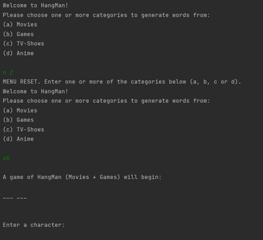
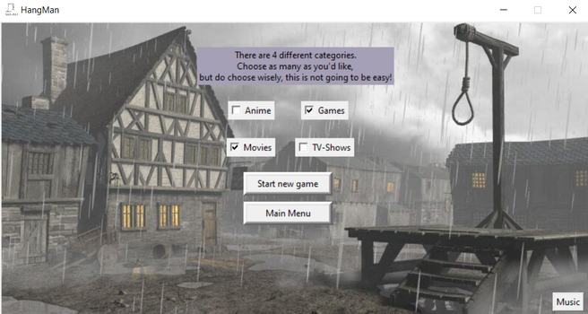
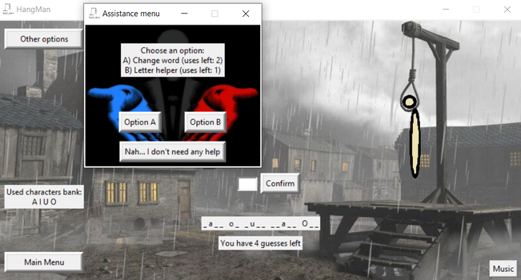

# HangMan 
## HangMan Game - Guess The Word

### Table of contents
* [General info](#general-info)
* [Technologies](#technologies)
* [Setup](#setup)
* [Example run](#example-run)

#### General Info
Getting familiar with the fundamentals of Python (Tkinter-GUI) by writing HangMan game as my first Python project, while making sure no edge cases were left unattended!

#### Technologies
* Python 3.8
* Pygame 2.0.1
* Pillow 8.1.2
* PyCharm IDE

#### Setup
Run in your favorite IDE.
Install Pygame and Pillow packages using,
```
pip install pygame
pip install Pillow
```

#### Example run
##### Concept (no GUI):
 <br>

##### Concept (with GUI):
 <br>
 <br>

<br>
<br>

* 2.9.2022 done some minor refactoring and fixed bugs in non-GUI hang_man.py file
